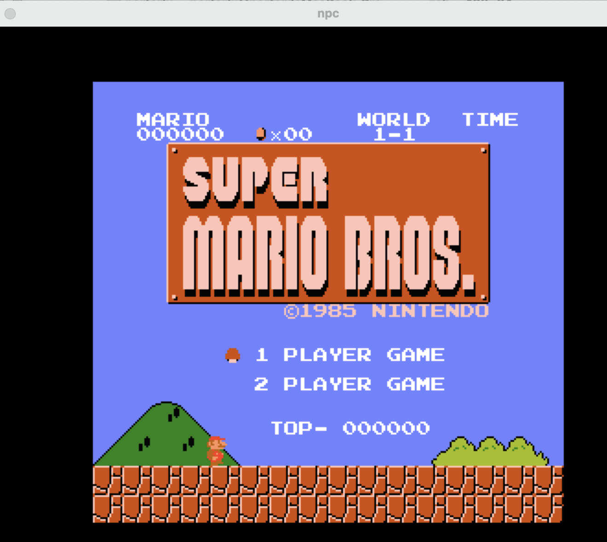

# SUSTemu

A RISC-V CPU simulator for computer architecture education, based on the RV64-IM ISA. Supports functional interpretation, in-order pipeline, out-of-order execution (Tomasulo + ROB), branch prediction, multi-core simulation, and a two-level cache hierarchy — suitable for architecture lab experiments and performance analysis.

## Features

### ISA Support
- **RV64-IM**: Base integer ISA + multiply/divide extension
- **Zicsr**: CSR instructions (`mhartid`, `mcycle`, etc.), supports `rdcycle` for benchmarking
- System instructions: FENCE, FENCE.I, ECALL, MRET, EBREAK

### Execution Modes

| Mode | Description | Flag |
|------|-------------|------|
| Functional (default) | Interpreted execution; correctness baseline | _(default)_ |
| In-order pipeline | 5-stage IF/ID/EX/MEM/WB with hazard handling | `--inorder` |
| Out-of-order (Tomasulo) | ROB + reservation stations + physical register file + RAT/RRAT | `--ooo` |

### Branch Prediction
- Branch Target Buffer (BTB)
- Tournament predictor: local history (LHT/LPHT) + global history (GHR/GPHT) + meta selector

### Cache Hierarchy
- Two-level cache: private L1I/L1D per core + shared L2
- Configurable sets (`s` bits) and ways (`w`); fixed 64-byte cache lines
- LRU replacement, write-back + write-allocate

### Multi-Core Simulation
- Dual-hart simulation with independent L1I/L1D, pipeline/OOO state, and branch predictor per core
- Write-invalidate cache coherence protocol
- FENCE instruction enforces memory ordering across OOO cores

### Peripherals
- Serial (UART output for bare-metal programs)
- Flash, RTC, VGA, Keyboard

---

## Installation

### Dependencies

#### Ubuntu / Linux
```bash
sudo apt install gcc g++ make libsdl2-dev libreadline-dev llvm-11-dev
```

#### macOS (Homebrew)
```bash
brew install llvm sdl2 readline riscv-gnu-toolchain python3
pip3 install kconfiglib
```

> **macOS notes:**
> - The build system auto-detects macOS (`uname -s`) and switches to `clang`/`clang++` with Homebrew paths.
> - LLVM 20+ is supported (compatible with LLVM ≥ 11).
> - `kconfiglib` replaces Linux-specific `mconf`/`conf` for `make menuconfig`.

### Build

```bash
make
```

The simulator binary is produced at `build/sustemu`.

### Configuration (optional)

```bash
make menuconfig   # interactive Kconfig menu; writes include/generated/autoconf.h
```

---

## Running

### Quick test
```bash
make test          # builds test/kernel.bin and runs it; exit 0 = pass
```

### Custom image
```bash
./build/sustemu <image.bin>                               # functional mode
./build/sustemu --inorder <image.bin>                     # in-order pipeline
./build/sustemu --ooo --bpred <image.bin>                 # OOO + branch predictor
./build/sustemu --ooo --bpred --dual <image.bin>          # dual-core OOO
./build/sustemu -b -e <image.elf> <image.bin>             # with ELF symbol info
```

### Benchmark targets
```bash
make bench            # functional / in-order / in-order+bpred / OOO+bpred on kernel
make bench-dhrystone  # Dhrystone 2.1 across all modes
make bench-dual       # dual-core OOO + bpred on independent Dhrystone workloads
```

---

## Running Super Mario Bros (LiteNES)

SUSTemu can run a full NES emulator ([LiteNES](https://github.com/NJU-ProjectN/litenes)) as a RISC-V workload, which provides a realistic stress test of the pipeline and branch predictor.

### Prerequisites

The RISC-V cross-compiler and SDL2 must be installed (see [Installation](#installation)).
A pre-built binary is included at `litenes/build/`; rebuild with:

```bash
AM_HOME=$(pwd)/am make -C litenes ARCH=riscv64-nemu
```

### Run targets

| Target | Mode | Command |
|--------|------|---------|
| OOO + branch predictor (default) | `--ooo --bpred` | `make run-mario` |
| In-order pipeline + bpred | `--inorder --bpred` | `make run-mario-inorder` |
| Functional interpreter | _(default)_ | `make run-mario-functional` |
| OOO + difftest | `--ooo --bpred --difftest` | `make run-mario-difftest` |

```bash
make run-mario
```



> On Linux, the emulator is pinned to core 0 via `taskset -c 0` for consistent timing.
> On macOS, SDL2 renders the NES display in a native window; ensure a display is available.

---

## Labs

All lab assignments live under `labs/`. Each lab contains numbered questions (`Q1`, `Q2`, …) with a `Makefile` providing `run`, `run-inorder`, `run-ooo`, etc. targets. Build the simulator first (`make` in the repo root) before running any lab.

### Lab 4 — Out-of-Order Execution (`labs/ooo_lab/`)

Explores instruction-level parallelism, Tomasulo scheduling, and memory-latency hiding under OOO execution.

| Question | Topic |
|----------|-------|
| Q1 (`ilp/`) | ILP: in-order vs OOO throughput on independent instruction chains |
| Q2 (`tomasulo/`) | Tomasulo scheduling: RAW dependence chains, ROB commit order |
| Q3 (`memlat/`) | Memory-latency tolerance: pointer-chasing under in-order vs OOO |

```bash
cd labs/ooo_lab/Q1/ilp && make run-inorder   # in-order baseline
cd labs/ooo_lab/Q1/ilp && make run-ooo       # OOO execution
```

### Lab 5 — Branch Predictor (`labs/predictor_lab/`)

Measures branch misprediction costs and evaluates predictor designs across synthetic and real-world branch patterns.

| Question | Topic |
|----------|-------|
| Q1 | Misprediction penalty: OOO without vs with branch predictor |
| Q2 | Loop unrolling and its effect on branch frequency |
| Q3 | In-order vs OOO misprediction recovery cost |
| Q4 | Tournament predictor vs confidence-fusion predictor |
| Q5 | Spectre-style speculative execution side-channel |

```bash
cd labs/predictor_lab/Q1 && make run-bpred
```

### Lab 8 — Memory Ordering (`labs/order_lab/`)

Demonstrates relaxed memory ordering on the OOO dual-core simulator and the role of FENCE instructions.

| Question | Topic |
|----------|-------|
| Q1 | Litmus test (store-load reordering) with and without FENCE |
| Q2 | Shared counter: race conditions under relaxed ordering |
| Q3 | Peterson's mutual-exclusion algorithm: correctness requires FENCE |

```bash
cd labs/order_lab/Q1 && make run        # no fence (may observe reordering)
cd labs/order_lab/Q1 && make run-fence  # with FENCE (sequentially consistent)
```

### Cache Lab (`labs/cache_lab/`)

Measures cache performance effects on memory-bound workloads.

| Question | Topic |
|----------|-------|
| Q1 (`stream/`) | Memory bandwidth: sequential streaming access |
| Q2 | Matrix multiplication: cache-friendly vs naive layout |
| Q3 | Sequential scan: working-set size vs L1/L2 capacity |

```bash
cd labs/cache_lab/Q2 && make run
```

---

## Licenses

| Component | License | Source |
|-----------|---------|--------|
| SUSTemu (this repository) | MIT | — |
| [NEMU](https://github.com/NJU-ProjectN/nemu) | GPL-2.0 | Nanjing University; SUSTemu is architecturally inspired by NEMU |
| [AbstractMachine (`am/`)](https://github.com/NJU-ProjectN/abstract-machine) | MIT | Nanjing University |
| [LiteNES (`litenes/`)](https://github.com/NJU-ProjectN/litenes) | MIT | NJU-ProjectN |
| [kconfiglib](https://github.com/ulfalizer/Kconfiglib) | ISC | Ulf Magnusson |

> SUSTemu is developed at SUSTech (Southern University of Science and Technology) for computer architecture coursework. It is not affiliated with or endorsed by Nanjing University.
